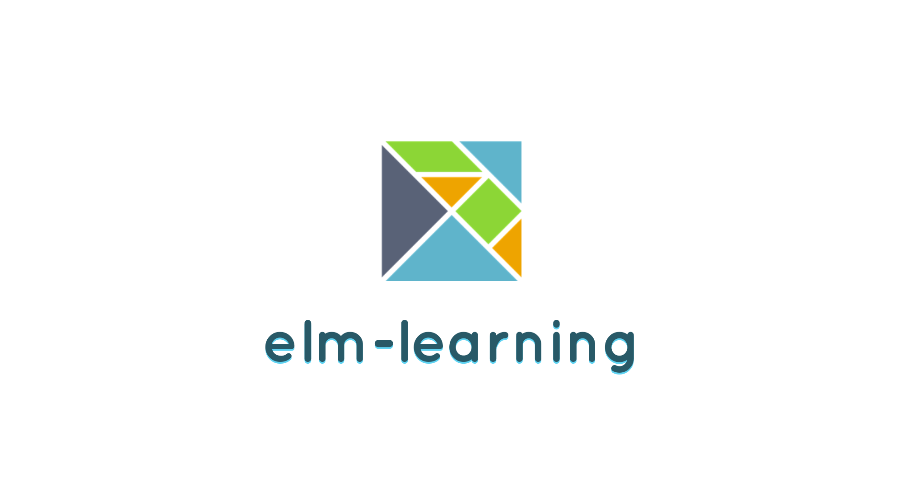

	A curated and concise list of <strong>free resources</strong> to learn <strong>Elm</strong> Development.

## Table Of Contents
- [Motivation](#motivation)
- [Why Elm?](#why-elm)
- [Resources](#resources)
	- [Articles](#articles)
	- [Built with Elm](#built-with-elm)
	- [Courses](#courses)
	- [Exercises](#exercises)
- [How To Collaborate](#how-to-collaborate)
- [Team](#team)
- [Additional Resources](#additional-resources)

## Motivation
This project aims to collect the **best free resources** for those that want to learn how to build applications with **Elm** and also understand functional programming concepts that come with its adoption.

## Why Elm?
1. [Why I think Elm is the Future of Front End Development](https://medium.com/@rgoomar/why-i-think-elm-is-the-future-of-front-end-development-21e9b091fa05#.3mzwb0w7i)

## Resources
### Articles
1. [An Introduction to Elm](http://guide.elm-lang.org/)
1. [Elm Docs](http://elm-lang.org/docs)
1. [ElmBridge](https://raorao.gitbooks.io/elmbridge-curriculum/content/)
1. [Elm tutorial](https://www.elm-tutorial.org/en/)
1. [Building a Live-Validated Signup Form in Elm](http://tech.noredink.com/post/129641182738/building-a-live-validated-signup-form-in-elm)
1. [Single-Page Web Apps in Elm](https://www.linkedin.com/pulse/single-page-web-apps-elm-part-one-getting-started-new-kevin-greene)
1. [Elm Cheat Sheet](https://github.com/izdi/elm-cheat-sheet)

### Built with Elm
1. [Built with Elm](http://builtwithelm.co/)
1. [awesome-elm examples](https://github.com/isRuslan/awesome-elm#examples)
1. [Practical examples in Elm](https://github.com/halfzebra/elm-examples)

### Courses
1. [Elm For Beginners](http://courses.knowthen.com/p/elm-for-beginners)
1. [Start Using Elm to Build Web Applications](https://egghead.io/courses/start-using-elm-to-build-web-applications)
1. [Elm on Egghead](https://egghead.io/technologies/elm#all-lesson-list)
1. [Elm Seeds](https://elmseeds.thaterikperson.com/)

### Exercises
1. [Exercism - Elm](http://exercism.io/languages/elm/about)

## How To Collaborate
To suggest new sections or new resources, open **one issue** for each resource/section explaining why we should add/remove such item. After at least 5 people approve (:+1:) your indication, you will be invited to create the pull request.

The reason to keep this way of collaboration is to ensure that our list of resources will be really concise, bringing only the best resources for those that want to master the topics listed here.

## Team
- **Project creator**: [Eric Douglas](https://github.com/ericdouglas)
- **Project maintainer**: [Eric Douglas](https://github.com/ericdouglas)
- **Contributors**: [contributors](https://github.com/ericdouglas/elm-learning/graphs/contributors)

## Additional Resources
1. [awesome-elm](https://github.com/isRuslan/awesome-elm)
1. [dev-log/elm](https://github.com/ericdouglas/dev-log/blob/master/source/elm.md)
